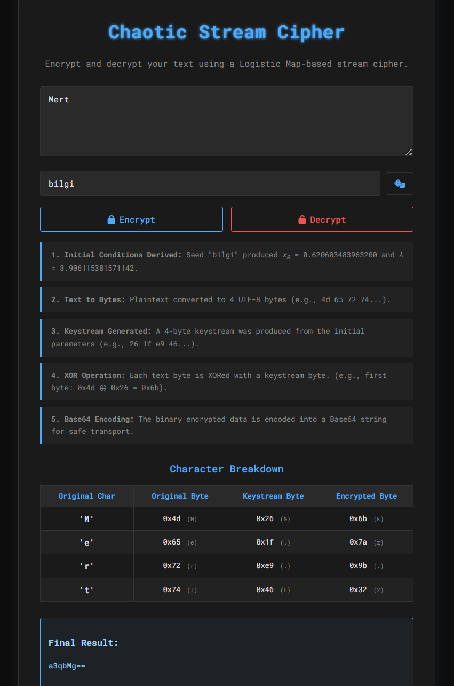
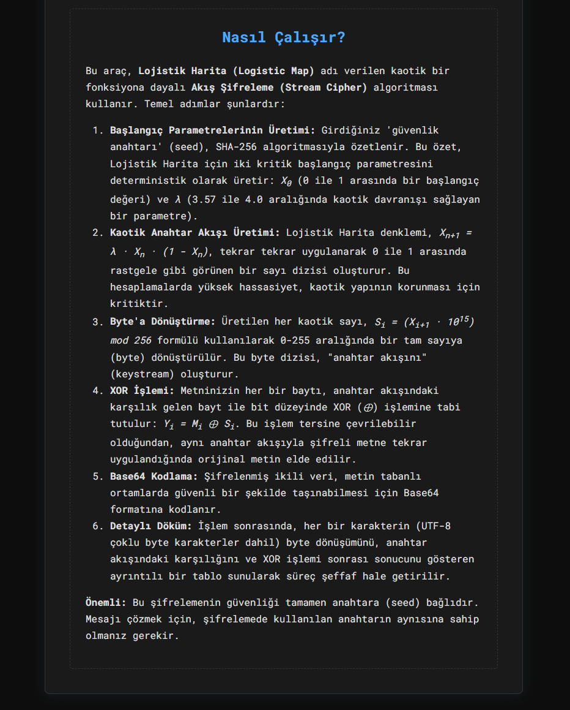

# Chaotic Stream Cipher

A web-based cryptographic tool that implements a stream cipher using a chaotic logistic map. This project was developed as an assignment for an Information Systems Security course.

## 🚀 Features

-   **Chaotic Keystream Generation:** Uses the logistic map (`Xn+1 = λ * Xn * (1 - Xn)`) to generate a pseudo-random keystream.
-   **Seed-Based Encryption:** All cryptographic parameters (`X₀` and `λ`) are deterministically derived from a user-provided text seed using SHA-256.
-   **Symmetric Encryption/Decryption:** Employs a standard XOR operation to both encrypt and decrypt text.
-   **Interactive Web Interface:** A user-friendly UI built with Flask and JavaScript to easily perform cryptographic operations.
-   **Detailed Process Visualization:** Provides a step-by-step summary of the entire cryptographic process.
-   **Character Breakdown Table:** Displays a detailed, byte-by-byte table showing how each character is encrypted/decrypted, including proper handling for multi-byte UTF-8 characters.
-   **Dual Byte Representation:** Shows byte values in both hexadecimal and their printable character equivalent (e.g., `0x42 ('B')`) for enhanced readability.

## 🛠️ How It Works

The application follows the classic stream cipher architecture but uses a chaotic function as its Pseudo-Random Number Generator (PRNG).

1.  **Seed to Parameters:** The user's text seed is hashed with SHA-256. The resulting hash is used to generate the initial value `X₀` (between 0 and 1) and the control parameter `λ` (in the chaotic range of 3.9 to 3.9999).
2.  **Keystream Generation:** The logistic map equation is iterated using these parameters to produce a sequence of chaotic floating-point numbers.
3.  **Byte Conversion:** Each number in the sequence is converted into a byte (0-255) to form the final keystream.
4.  **XOR Operation:** The input text (as bytes) is XORed with the keystream to produce the ciphertext. The same process decrypts the ciphertext back to plaintext.

## 🖼️ Application Screenshots

Here are some screenshots of the application in action:

**Main Interface:**


**Encryption/Decryption Process:**


## ⚙️ Setup and Installation

To run this project locally, follow these steps:

1.  **Clone the repository:**
    ```bash
    git clone https://github.com/mert-ucan/Chaotic-Stream-Cipher.git
    cd Chaotic-Stream-Cipher
    ```

2.  **Create and activate a virtual environment (recommended):**
    ```bash
    # For Windows
    python -m venv venv
    .\venv\Scripts\activate

    # For macOS/Linux
    python3 -m venv venv
    source venv/bin/activate
    ```

3.  **Install the dependencies:**
    ```bash
    pip install -r requirements.txt
    ```

4.  **Run the Flask application:**
    ```bash
    python app.py
    ```

5.  Open your web browser and navigate to `http://127.0.0.1:5000`.

## 💻 Technologies Used

-   **Backend:** Python, Flask
-   **Frontend:** HTML, CSS, JavaScript
-   **Cryptography:** SHA-256 for seeding, Logistic Map for PRNG